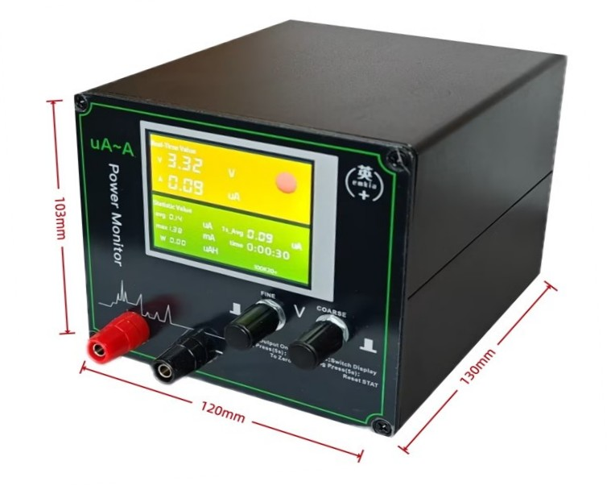

# EMK850+ 低功耗分析仪 · 串口驱动 + MCP 服务器

[English](README.md) | [中文](README.zh-CN.md)

逆向英加 EMK850+ 低功耗分析仪串口协议，提供 Python 命令行工具与 MCP 服务器（Streamable HTTP + REST），实现 µA/µW 级功耗自动采集与可编程电源控制，打通 AI 自动化低功耗优化闭环。



## 项目亮点

原厂 EMK850\+ 低功耗分析仪存在极大的自动化使用局限，设备仅提供 Windows 可视化操作界面，无官方开放 API 接口，无法对接脚本、程序、AI 自动化平台，不能实现功耗测试、设备控制的自动化闭环操作，极大限制了设备在批量测试、智能调试、低功耗优化迭代场景的应用。

针对以上痛点，本项目完成协议逆向与功能优化升级，完美适配自动化场景：

- **协议逆向**：复现设备 64 字节定长帧、0x33 帧头、0x40 分片机制的串口通讯协议

- **优化帧解析**：采用逐字节流式帧同步状态机机制，替代原厂上位机整块读取数据的方式，有效解决了因字节错位引发的程序卡死、数据解析异常等问题，显著提升系统鲁棒性

- **轻量化开箱即用**：提供 命令行工具 \+ HTTP 服务双模式，支持脚本调用、CI 集成、AI 自动化

- **可编程外部电压**：支持可编程电源断电重启操作，可唤醒进入深度休眠、调试器断连的 MCU，解决低功耗调试场景下的核心痛点

- **标准化采集**：支持 µA/µW 级精密功耗采集，搭配空载基线清零功能，可剔除设备空载偏移误差，输出纯净、精准的电压、电流、功率测量数据

## 快速上手

### 命令行读取功耗
```bash
uv sync
python emk850_analyzer.py power COM19
```
```text
电压: 4.202 V   电流: 6.940 uA   功耗: 29.20 uW
```

### 启动服务（REST + MCP）
```bash
python emk850_mcp_server.py --port COM19 --http 37749
```
启动后同一进程同时提供 **REST 接口** 与 **MCP 服务器** 两套接入方式：

- **REST**：访问 `http://localhost:37749`，任何 HTTP 客户端均可调用
- **MCP**：连接 `http://localhost:37749/mcp`（MCP Streamable HTTP 传输），支持 Claude / Cursor / MCP Inspector 等 MCP 客户端

REST 端点：

| 端点 | 方法 | 说明 |
|---|---|---|
| `/power?sample_s=0.8` | GET | 读功耗（V/I/P，自动 启动→采样→停止） |
| `/output` | POST | 设输出：`{"state":"on","voltage":3.3}` 设 3.3V，`{"state":"off"}` 设 0mV |
| `/clear` | POST | 空载清零，需 `{"confirm":true}` |
| `/version` · `/config` · `/health` | GET | 版本 / 校准参数 / 服务与设备状态 |
| `/start` · `/stop` | POST | 手动开始 / 停止采样 |

MCP 工具（REST 路由自动转换，工具名 = 路由 operationId）：

| 工具 | 参数 | 说明 |
|---|---|---|
| `read_power` | settle_s, sample_s | 读功耗（V/I/P） |
| `read_version` | – | 读设备版本 |
| `read_config` | – | 读校准配置 |
| `start_sampling` / `stop_sampling` | – | 手动开始 / 停止采样 |
| `set_output` | state, voltage | 设输出电压 / 切断供电（掉电重启休眠芯片） |
| `clear_counter` | confirm, wait_s | 空载清零（需 `confirm=true`） |
| `get_port_info` / `open_port` / `close_port` | port | 串口管理 |
| `health` | – | 服务与设备状态 |

#### 用 MCP 客户端连接
MCP 端点：`http://localhost:37749/mcp`

- **MCP Inspector / MCP 调试工具**：连接类型选 *Streamable HTTP*，地址填 `http://localhost:37749/mcp`，即可 `initialize` 握手、`tools/list` 列出上述工具、`tools/call` 调用
- **Claude Desktop / Cursor**：把该 URL 注册为远程 MCP 服务器即可

## 典型实战：唤醒休眠 MCU

低功耗场景下 MCU 进入深度休眠后调试器断连，可用仪器断电复位唤醒：

1. 关闭输出：`POST /output {"state":"off"}`
2. 等待电容放电 10~15 秒
3. 恢复 3.3V 输出：`POST /output {"state":"on","voltage":3.3}`
4. 芯片复位，调试器可重新连接

> 注：`"off"` 通过设 0mV 间接拉低输出（协议无直接关断命令）。实测 0mV 时测量端约 2.6V，是否真正断电请用万用表确认，别只靠这个判断芯片已掉电。

## 协议关键信息

- 串口：**115200 / 8N1**
- 帧结构：固定 64 字节，帧头 `0x33`，支持 `0x40` 延续帧分片
- 避坑：摒弃原厂整块读取方式，采用流式状态机保证同步可靠性

完整命令表、数据换算公式详见：[docs/EMK850_PROTOCOL.md](docs/EMK850_PROTOCOL.md)

## 注意事项

- 串口资源独占，HTTP 服务运行时不可与原厂上位机同时使用
- 空载清零需断开所有负载，否则会引入测量误差
- 设备自动换挡，未校准档位电流数据将被自动跳过

## 免责声明

本项目协议通过逆向原厂上位机实现，与英加厂商无关、未获官方认可。固件或型号升级可能导致不兼容，使用风险自负。

---

项目地址：https://github.com/createskyblue/Yingjia_EMK850_low-power_analyzer_MCP
